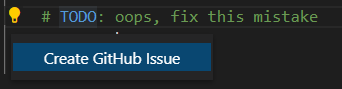
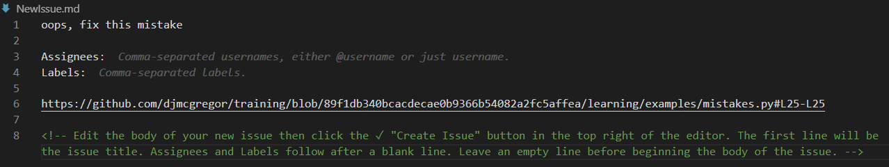
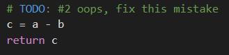

# Beginner Tutorials
#### Sections
- [Introduction to Git and GitHub](#introduction)
- [Initial setup](#initial-setup)
    - Setup Git and GitHub
    - Fork this repo and create a local copy
    - Set up Visual Studio Code editor
- [Basic Git commands](#git-commands)
- [GitHub Workflow](#github-workflow)
- [Practice](#practice)
    - Observe how Git tracks your changes
    - GitHub PR
---
## Introduction
As a general note, code examples within these tutorials use the `<...>` notation to indicate information that needs to be replaced with your specific information. For example, in the initial setup I would replace
```bash
$ git config --global user.name "<Your Name>"
```
with
```bash
$ git config --global user.name "Davis McGregor"
```
Notice I keep the quotes, but lose the brackets.

#### Git
Git is an open source version control system for code that enables seamless parallel development across numerous users. It's similar to a combination of "track changes" and "compare documents" in a word processor, with the additional functionality of storing messages at each save point (aka commit). A collection of documents managed with Git is called a repository (or repo for short).

Git commands follow Linux syntax, but don't let that intimidate you. Git is fairly easy to learn, and is extremely powerful. However, with great power comes the potential for great mistakes. Luckily, most mistakes are recoverable with some effort. But that's what this playground is all about. Make mistakes, learn from them, and restart the playground as needed. 

- It may be helpful to understand that Git operates with three images, or copies, of code:
    - Repositories stored online, such as with GitHub, are referred to as "remotes" and their branches as "remote branches"
    - Code on your personal machine is referred to as "local" and their branches as "local branches"
    - The third copy of code bridges the gap between local and remote branches, and is called "remote-tracking." Git constantly compares code on *local* branches to *remote-tracking* branches to see if there are any changes. If there are changes to a *remote* branch itself, such as changes made by a collaborator, we have to physically update the *remote-tracking* branch on our machine with `git fetch`, or equivalent, in order to see those changes in Git. This will become more clear as we work with Git.
    - *Remote-tracking* and *remote* branches are often assumed to be identical and just referred to as "remotes." I won't place too much emphasis on their difference moving forward. However, knowing this distinction should help if you ever find a situation where the *remote* and *remote-tracking* branches are not identical. As a developer, it is up to you to keep them synchronized. If you forget, Git will gently remind you.
- A local pointer called `HEAD` points to the last commit you made to the current branch, or the last commit that was checked out into your working directory. In simple terms, it indicates where the current code you are looking at falls in the Git history.

#### GitHub
GitHub is just one of many third party companies offering a graphical interface for Git repositories. Some of the features GitHub offers include repository hosting, pull requests, issue tracking, discussions, and automated workflows. If you are accessing this playground, then I will assume you already setup a GitHub account.

---
## Initial Setup
This is an excellent [Guide](https://docs.github.com/en/github/getting-started-with-github) for getting everything set up. I have also summarized some of the important steps that will help you learn. I recommend you follow both simultaneously.

#### Configure Git
1. Install and open Git Bash from https://git-scm.com/downloads
0. In Git, configure your username and email address associated with your work
    ```bash
    $ git config --global user.name "<Your Name>"
    $ git config --global user.email "<youremail@yourdomain.com>"
    ```
#### Setup your training repo
3. Fork (i.e. make a copy) this repository to your GitHub account. 
    - Navigate to this repository at https://github.com/djmcgregor/training
    - In the upper right hand corner, click on the **Fork** button. This will create a copy of this repository in your personal GitHub account. Now you can make all the changes you want in your personal playground, and the Lab copy will remain unchanged if you ever need to start over.
    
        
0. Clone the code to your local machine
    - Copy the clone link for your new repo. This can be accessed through GitHub. Click the green **Download Code** button and copy the **Clone with HTTPS** link
    
        
    - In Git, navigate to a directory where you want to make a local copy of your new repo
        - Use `cd <folder>` to move into a folder, and `cd ..` to move up a directory
    - Now use Git to `clone` your new repo. You can paste the clone link by pressing `shift + insert`
        ```bash
        $ git clone https://github.com/<username>/training.git
        #                              ^ replace with your actual GitHub username
        ```
0. You should now see a copy of this repo on your local machine. In Git, navigate into the new folder with `cd training`
0. Type `git remote -v` and press **Enter**
    ```bash
    $ git remote -v
    > origin  https://github.com/<username>/training.git (fetch)
    > origin  https://github.com/<username>/training.git (push)
    ```
    - You will see that we have setup a remote named `origin` located at your training repo on GitHub, and it is being used for `fetch` and `push` commands.
    - In Git, repositories online are referred to as "remotes" while code on your personal machine is "local." You can have multiple remotes in one local repo, and name them different things. The standard names for remotes are `origin` and `upstream`
        - `origin` for your main copy of code on GitHub
        - `upstream` is typically used for forked repos, and points to the GitHub repo you forked from (e.g. https://github.com/djmcgregor/training.git)
        - There is no need to set up an `upstream` remote right now

#### Code Editor
7. Setup your editor of choice. Personally, I like developing in [Visual Studio Code](https://code.visualstudio.com/) (VSC), but there are many options.
    - VSC has a ton of convenient keyboard shortcuts, and you can create even more custom ones. [Cheat sheet](https://code.visualstudio.com/shortcuts/keyboard-shortcuts-windows.pdf)
0. If using VSC, I recommend installing the following extensions to get started
    - [Git Graph](https://marketplace.visualstudio.com/items?itemName=mhutchie.git-graph) - great for seeing repo history
    - [GitHub Pull Requests and Issues](https://marketplace.visualstudio.com/items?itemName=GitHub.vscode-pull-request-github) - great for creating issues from key phrases such as `# TODO`
    - [Markdown Preview Enhanced](https://marketplace.visualstudio.com/items?itemName=shd101wyy.markdown-preview-enhanced) - preview markdown right in VSC
    - [Python](https://marketplace.visualstudio.com/items?itemName=ms-python.python) - for developing in Python
0. Within VSC, select `File > Open Folder` and select the local `training` repo we just created.
    - You should now see a list of all the files included in this training repo. You can select individual files and inspect the contents, make changes, etc.
    - On the left hand sidebar, select the **Source Control** tab. A new menu should appear. At the top, click on the **View Git Graph (git log)** button
    - You should now see a pretty graph of the history of this repo. Each dot represents a commit, and if you click on it, you can see all the associated metadata
        - Commit message: short explanation of what changed (use present tense)
        - Commit hash or SHA: very long, but unique ID for the commit. We can reference this hash later
        - Username and email of the commit author
        - Commit time
        - List of files changed
    - You can even click on one of the files changed and see exactly what lines of code changed in the commit. Green represents additions, and red indicates deletions
    
        

---
## Git Commands
There are a couple git commands that are necessary to understand as you get started. There are often several ways to accomplish the same task, but these are the methods I use and have found to be the easiest to understand. For full explanations, I suggest you lookup the command at https://git-scm.com/docs/

**Need to Know**
- `git clone <url>`
    - Create a local copy of a remote repository
- `git fetch`
    - Update your remote-tracking branches with all changes made to the remote GitHub repository
    - Preview changes that have been made to the remote before incorporating them into your local code
    - I rarely use this
- `git merge` or `git merge <branch name>`
    - Combines remote-tracking branch or specified local branch into the current local branch
    - I rarely use this
- `git pull`
    - Equivalent to running `git fetch` followed by `git merge`
    - I run this everyday before I start making changes
- `git add <filename>` or `git add .`
    - Add a specific file or all files to the staging
    - I usually just do this in VSC
- `git commit -m '<commit message>'`
    - Save staged changes to the version history along with a useful message (written in present tense)
    - I usually just do this in VSC
- `git push`
    - Update GitHub remote with all committed local changes
    - Many times I just do this in VSC
    - If you are ever instructed to run `git push --set-upstream origin main`, it is because your local branch does not know what remote to track. Here, `origin` is the suggested remote name, and `main` is the suggested remote branch name (I suggest it match the current local branch name)

**Use Everyday**
- `git status`
    - See the status of your repo. Which files are new, deleted, have modification, or are staged for committing. Also see if your local copy of the code is behind the remote-tracking code (a recent `git fetch` ensures the remote-tracking code is up to date with the remote code).
- `git branch` or `git branch -a`
    - List of local branches or list of all local and remote-tracking branches
- `git checkout -b <new branch name>` or `git checkout <existing branch name>`
    - Create and/or switch to a new branch
- I typically run `git add`, `git commit` and `git push` commands directly in VSC under the **Source Control** tab

**Cleanup**
- `git branch -d <branch to delete>`
    - Delete a remote branch
- `git remote prune <remote name>`
    - Delete stale remote branches (i.e. branches that have been merged and deleted in GitHub)

**Pretty Graph**
- `git log --all --decorate --oneline --graph`
    - Graph view of the git history
    - In practice I just use the VSC Git Graph extension, but this also works

---
## GitHub Workflow
Often, we work on code with other people. GitHub is an excellent tool to communicate with each other about proposed changes, bugs, and questions. Read about the GitHub workflow at https://guides.github.com/introduction/flow/


**TLDR**
- Keep the `main` or `master` branch clean and develop new features in parallel branches. 
- Checkout a branch, make commits, and open a GitHub Pull Request (PR).
- You can assign or request review from some of your colleagues, view all the proposed changes on the branch, and add comments on specific lines of code or in the general PR discussion section.
- You should title your PR something informative and relatively short, and provide a detailed description of what changes you are proposing.
- If you make any commits after starting the PR, they will be added to the open PR
- When the review is complete, the feature branch can be merged back into `main` and deleted.

**Notes**
- It is good form to keep the number of proposed changes in a PR to a reasonable amount. Massive PRs are difficult to review and hide bugs easier than small PRs.
- While you are working on a feature branch, any number of other parallel branches can be checked out and worked on. Git will track where they diverged from `main` and how compatible they are with subsequent changes merged into `main`.

---
## Practice
As you walk though this practice session, frequently check the git log or git graph and observe how things are updating. 

1. Create a new branch
    - View a list of current local and remote branches
        ```bash
        $ git branch -a
        > * main
        >   remotes/origin/HEAD -> origin/main
        >   remotes/origin/main
        #           ^      ^ remote branch name is 'main'
        #           | remote name is 'origin'
        ``` 
    - Checkout a new branch, set the remote tracking branch, and view branches again
        - When you create and checkout a new branch locally, you need to let Git know what remote branch should track the new local branch. For this, we have `git push --set-upstream <remote> <branch>`
        - To avoid confusion, we usually set the local and remote branch names to be identical, but it is not required
        ```bash
        $ git checkout -b practice
        $ git push --set-upstream origin practice
        $ git branch -a
        > * practice
        >   main
        >   remotes/origin/HEAD -> origin/main
        >   remotes/origin/practice
        >   remotes/origin/main
        # We now have new local and remote branches named 'practice'
        ```
    - Check GitHub and see that the remote branch is now online
0. Make a local change and push to GitHub
    - Open VSC and make a change to the `README.md` file
    - Check the status with `git status`
    - In VSC, preview the changes on the **Source Control** tab (easier than running `git diff [<file>]`)
    - Commit the changes locally
        ```bash
        $ git add .
        $ git commit -m 'practice edit to README'
        ```
    - Check the commit history in VSC. Notice how the local `practice` head is ahead of the `origin/practice` head. If you check GitHub, nothing has changed
    - Let's push the changes to GitHub with `git push`
0. Open a PR
    - In GitHub, navigate to the `practice` branch and click on the **Pull request** button
        - Notice we are proposing to merge `practice` into `main`
    - Give it a good name ("My first PR") and description ("Super important edit to the README")
    - Click create and explore
        - You should be able to see all of your proposed changes with nice green and red highlighting
    - Maybe you want to try adding another commit after the PR has been opened. Notice how it is added to the already opened PR.
    - On the far right, you can add reviewers and assign people responsible for the PR.
0. When you are done exploring, go ahead and merge the PR into `main` and delete the `practice` branch via the GitHub interface
    - GitHub will present three options for merging
        - `Create a merge commit` is what you want for now. It will simply merge the `practice` branch into the `main` branch.
        - I advise a more thorough understanding of Git before using either of the other two options. They are destructive methods and difficult to recover from. We will cover them in the [advanced modules](./advanced.md).
        - `Squash and merge` will condense all commits into one commit, and then merge (use with caution)
        - `Rebase and merge` will pickup all `practice` branch commits and rewrite them onto the tip of the `main` branch (use with caution)
    - In Git, run some commands to explore what is needed when you have updates to the remote
        ```bash
        $ git checkout main
        $ git status
        # notice Git doesn't recognize that anything has changed

        $ git fetch
        $ git status
        # now that you have fetched changes to the remote/origin,
        # Git recognizes that your local code is behind the remote
        # if you try to push new changes at this point, it will fail

        $ git pull
        # recall 'git pull' is the same as 'git fetch' followed by 'git merge'
        # local code is now updated with the changes from origin

        $ git branch -a
        # you still have the local and remote 'practice' branches
        ```
    - If you run `git branch -a` you'll notice you still have the local and remote `practice` branches. Let's get rid of those. From the `main` branch
        ```bash
        $ git branch -d practice
        # this will delete the local 'practice' branch

        $ git remote prune origin --dry-run
        #                  ^      ^ preview what will be pruned, do not prune
        #                  | remote name is origin
        > Pruning origin
        > URL https://github.com/<username>/training.git
        > * [would prune] origin/practice
        
        # now let's actually prune
        $ git remote prune origin
        ```
    - Check `git branch -a` again, and notice the two `practice` branches are gone
0. Create a GitHub Issue
    - You can do this the traditional way through GitHub as explained [here](https://docs.github.com/en/github/managing-your-work-on-github/creating-an-issue) 
    - Let's explore a convenient alternative directly in VSC using the "GitHub Pull Requests and Issues" extension
    - In VSC, open [learning/mistakes.py](../learning/mistakes.py). Notice the `# TODO:` tag on line 25. This is one of the flags for the extension.
    - Click on `TODO` and hover. You should see a yellow lightbulb appear to the left. Click on the lightbulb and select "Create GitHub Issue"
    
        
    - When the "Create Issue" dialogue pops up, you can choose to edit the description and add more information such as assigning specific people or labels to the issue.
    
        
    - Finish creating the issue (click check mark and save changes). GitHub will now be updated with a new issue, and the extension automatically updates the `# TODO` tag with the issue number. Now your issue is linked to the code, and the code references the issue directly. Commit this update as you see appropriate.
    
        
    - You can explore more on the **GitHub** tab in VSC
